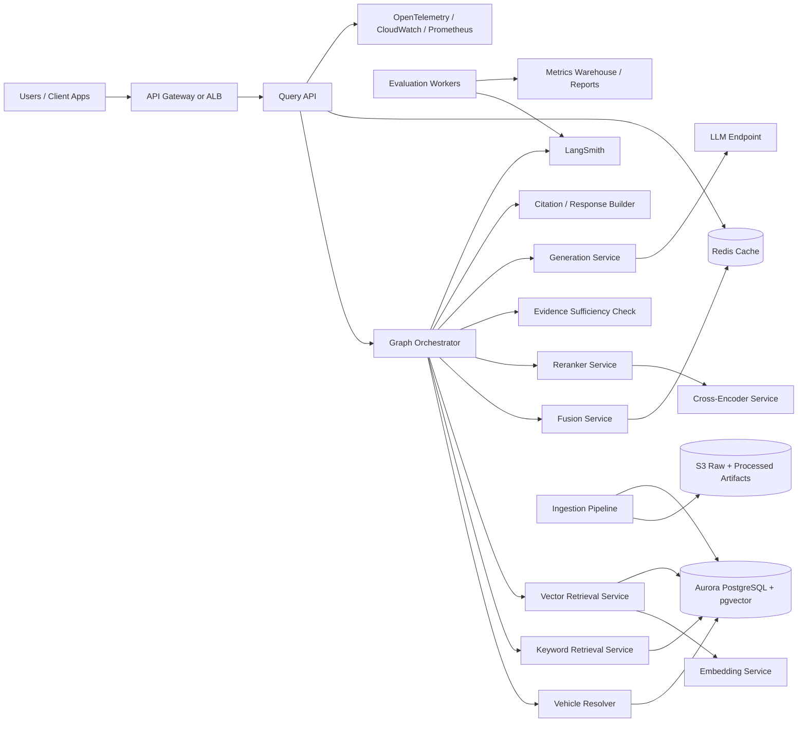
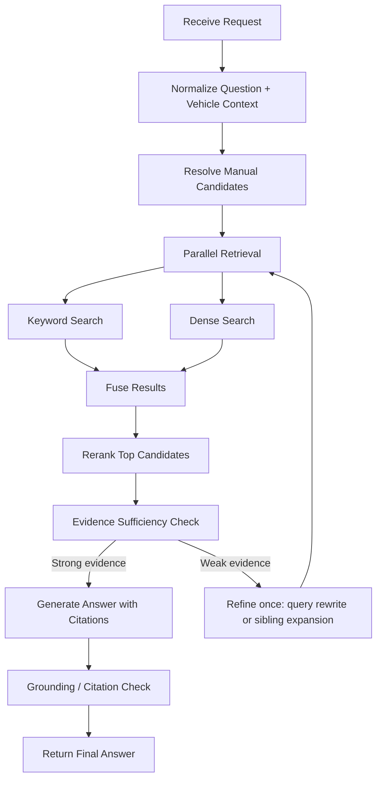
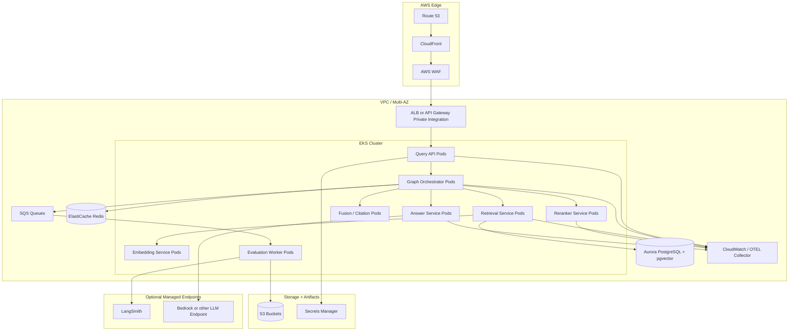
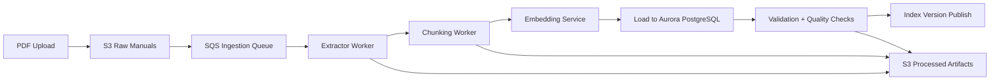
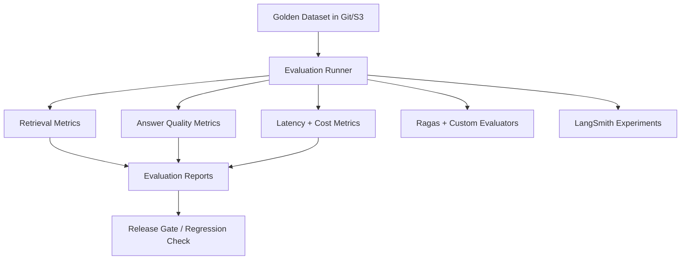

# v2 Architecture

This document defines the recommended `v2` architecture for the repo.

`v1` in this project is intentionally simple:

- custom ingestion
- PostgreSQL + pgvector + full-text search
- hybrid retrieval
- reranking
- evaluation before answer generation

That is still the right foundation.

`v2` changes the operating model, not the core retrieval principles.

The goal of `v2` is to turn the current repo into a `production-grade`, `AWS-hostable`, `graph-orchestrated` RAG system that can support:

- high traffic
- independent model services
- strong observability
- online and offline evaluation
- safe rollout and regression testing
- CI/CD and environment promotion
- managed cloud infrastructure for the online path and datastore

## Goal

Build a production RAG platform for automotive-manual question answering that:

- keeps the current evidence-first retrieval design
- introduces graph-based orchestration without uncontrolled agent loops
- serves separate local or self-hosted model endpoints for:
  - bi-encoder embeddings
  - cross-encoder reranking
  - answer generation or answer verification when needed
- supports continuous evaluation of:
  - retrieval quality
  - answer quality
  - latency
  - cost
  - reliability
- is deployable through a repeatable CI/CD workflow
- uses a cloud database instance instead of only a local development datastore

## Scale Assumption

`1M DAU` does not mean `1M concurrent users`.

For architecture planning, the more useful questions are:

- what is the peak requests-per-second load?
- what are the p95 and p99 latency targets?
- what percentage of traffic is read-heavy versus ingestion-heavy?

Reasonable v2 planning assumption:

- the system is overwhelmingly `read-heavy`
- ingestion is asynchronous and much lower volume than question answering
- traffic arrives in spikes, so autoscaling and backpressure matter more than average throughput

## What Changes From v1

Compared with the current repo, `v2` should change these decisions:

1. Move from a mostly monolithic Python application to `service-oriented components`.
2. Move from in-process models to `independent model-serving endpoints`.
3. Move from a linear retrieval pipeline to a `stateful graph workflow` with conditional routing.
4. Move from local-only scripts to `production deployment on AWS`.
5. Move from ad hoc evaluation scripts to `continuous offline and online evaluation`.
6. Move from best-effort logging to `trace-first observability`.
7. Move from local-only infrastructure assumptions to `managed cloud datastore and deployment workflows`.

What should stay the same:

- vehicle identity remains a first-class filter
- retrieval remains evidence-first
- hybrid retrieval remains the baseline
- reranking remains a second-stage ranker, not a corpus-wide search layer
- citations remain mandatory

`v2` should assume that `v1.1` has already identified the preferred:

- embedding defaults
- reranker defaults
- answer model defaults
- fusion defaults
- core benchmark workflow

## Production Principles

`v2` should follow these principles:

- keep the `documents -> sections -> chunks` data model
- keep retrieval and answer generation separable
- prefer `bounded graph routing` over open-ended agent loops
- isolate GPU-heavy model serving from request orchestration
- keep ingestion and evaluation asynchronous
- make every stage measurable
- preserve a path to exact debugging when approximate retrieval fails
- make deployment and rollback repeatable through CI/CD
- prefer managed infrastructure where it reduces operational risk without hiding critical retrieval behavior

## Recommended v2 Shape

The cleanest production shape is:

1. `Edge/API layer`
2. `Graph orchestration layer`
3. `Retrieval and ranking services`
4. `Model-serving layer`
5. `Data layer`
6. `Async ingestion and evaluation layer`
7. `Observability and experiment layer`
8. `Deployment and environment layer`

## Logical Architecture

## Request Workflow

The right `agentic` shape here is not an unrestricted agent.

It is a `graph with state and conditional edges`.

That means:

- each node has a narrow responsibility
- each node reads and writes typed workflow state
- routing is explicit
- retries are bounded
- loops are optional, not required

This is a much better fit than a free-form agent because the domain is:

- retrieval-heavy
- safety-sensitive
- latency-sensitive
- easy to overcomplicate

## Recommended Online Graph

Important rule:

- allow at most `one bounded refinement pass` in the synchronous request path

This keeps the workflow meaningfully graph-based without turning it into an unbounded loop.

## Node Responsibilities

### 1. Normalize Question + Vehicle Context

Responsibilities:

- normalize vehicle identity
- canonicalize user phrasing
- detect missing required fields
- attach request metadata for tracing

Outputs:

- `question`
- `make`
- `model`
- `year`
- normalized request ID

### 2. Resolve Manual Candidates

Responsibilities:

- map vehicle identity to one or more candidate `doc_id`s
- reject cross-manual search unless intentionally enabled

This preserves the current repo's strongest retrieval rule:

- `manual identity comes before retrieval`

### 3. Parallel Retrieval

Responsibilities:

- run keyword retrieval and dense retrieval in parallel
- keep each branch independently measurable

This is where the current `keyword`, `vector`, and `fused_results` logic naturally evolves into separate services or modules.

### 4. Fusion

Responsibilities:

- deduplicate by `chunk_id`
- fuse by `RRF` or a later weighted strategy
- emit an inspectable candidate set

Keep this logic in the application layer, just like the current docs recommend.

### 5. Rerank

Responsibilities:

- call the cross-encoder service on the fused top-k set
- return reranker scores plus ranking explanations when possible

Do not rerank the full corpus.

### 6. Evidence Sufficiency Check

Responsibilities:

- determine whether the current evidence set is good enough for answer generation
- decide whether to:
  - proceed
  - run one refinement pass
  - abstain

Good signals here:

- top reranker margin
- number of distinct supporting chunks
- section diversity when multi-section evidence is needed
- presence of expected procedural or warning-style chunk types

### 7. Refinement Branch

This is the most useful `agentic` addition for this domain.

Instead of open-ended planning, use one or two explicit refinements:

- query rewrite for lexical mismatch
- sibling expansion for split procedures
- parent-section expansion for context recovery

This matches the repo's current chunking design well because you already store:

- sibling order
- section lineage
- page spans

### 8. Generate Answer with Citations

Responsibilities:

- answer only from retrieved evidence
- cite chunk and page references
- preserve vehicle specificity
- abstain when evidence is weak

### 9. Grounding / Citation Check

Responsibilities:

- verify that each major claim is supported by retrieved evidence
- verify citations point to relevant chunks
- block clearly unsupported responses when confidence is low

This can be:

- a lightweight rule-based stage first
- later augmented by an LLM judge or Ragas-style faithfulness check offline

## Recommended Service Decomposition

The service split should be pragmatic, not maximal.

Recommended services:

### Online Path

- `query-api`
- `workflow-orchestrator`
- `vehicle-resolution-service`
- `retrieval-service`
- `fusion-service`
- `reranker-service`
- `answer-service`
- `citation-service`

### Model Endpoints

- `embedding-model-service`
- `cross-encoder-reranker-service`
- `llm-service` or managed hosted LLM endpoint

### Async Systems

- `ingestion-worker`
- `embedding-backfill-worker`
- `evaluation-runner`
- `reporting-worker`

Recommended rule:

- split out a service only when it has its own scaling profile, failure mode, or hardware need

That is why the embedding and reranker endpoints deserve isolation:

- they are model-heavy
- they may need GPU or tuned inference containers
- they scale differently from orchestration and API logic

## AWS Deployment Recommendation

For `v2`, the most coherent AWS target is:

- `CloudFront` for edge caching and TLS termination
- `AWS WAF` for request filtering and abuse protection
- `API Gateway` or `ALB` in front of the app tier
- `EKS` for graph orchestration and model-serving workloads
- `Aurora PostgreSQL` with `pgvector` for metadata, keyword, and vector retrieval
- `ElastiCache Redis` for hot caches and short-lived workflow state
- `S3` for raw manuals, processed artifacts, evaluation sets, and reports
- `SQS` and `EventBridge` for async ingestion and evaluation jobs
- `CloudWatch` plus `OpenTelemetry` for operational metrics
- `LangSmith` for traces, experiments, and application-level evaluation

Why `EKS` is a good fit here:

- graph workflows plus model-serving endpoints create mixed CPU and GPU workloads
- separate autoscaling policies are useful
- it keeps orchestration, retrieval APIs, and model servers in one controlled environment

If you want lower operational overhead first, `ECS` is also valid for the application tier.

But for a resume-oriented `v2` with explicit model services and graph orchestration, `EKS` is the clearest long-term production story.

## AWS Deployment Diagram

## Data Layer Recommendation

The current repo's relational shape is still the right core:

- `documents`
- `sections`
- `chunks`

For `v2`, extend it with:

- `ingestion_runs`
- `retrieval_runs`
- `answer_runs`
- `evaluation_runs`
- `feedback_events`

Recommended storage split:

- `Aurora PostgreSQL` as system of record for structured retrieval data
- `S3` for raw documents, extraction artifacts, embeddings snapshots, evaluation outputs, and audit reports
- `Redis` for:
  - short-lived caches
  - hot manual lookups
  - optional session-scoped workflow state

## Retrieval Store Recommendation

Keep `PostgreSQL + pgvector + full-text search` in `v2` unless production measurements prove it is insufficient.

Why this is still reasonable:

- the corpus is structured
- metadata filtering is strong
- queries are usually scoped to a known manual or small candidate set
- inspectability remains very high

When to revisit:

- if filtered vector search latency becomes unstable under load
- if corpus size or tenant count grows enough that index management becomes painful
- if hybrid ranking or shard behavior becomes hard to control

Likely next datastore only if needed:

- `OpenSearch` for larger search-native scale
- `Qdrant` for vector-first large-scale experiments

Do not switch stores just to look more production-like.

## Ingestion v2

Ingestion should become an asynchronous pipeline.

Recommended stages:

1. upload raw PDF to `S3`
2. enqueue ingestion job
3. extract structured content
4. build sections and chunks
5. call embedding service for chunk embeddings
6. write document, section, and chunk records
7. run ingestion validation checks
8. publish new index version

Recommended ingestion properties:

- idempotent
- versioned
- traceable
- backfillable

## Ingestion Diagram

## Evaluation v2

`v1` already made the right call by separating retrieval evaluation from answer evaluation.

`v2` should keep that and operationalize it.

### Retrieval Evaluation

Track:

- `Recall@k`
- `MRR`
- `section_hit_rate`
- `page_hit_rate`
- `complete_evidence_hit@k` for multi-chunk questions
- latency by stage:
  - keyword retrieval
  - dense retrieval
  - fusion
  - reranking

### Answer Evaluation

Track:

- correctness
- grounding / faithfulness
- citation quality
- completeness
- abstention quality
- vehicle specificity

### Performance Evaluation

Track:

- p50, p95, p99 latency
- queue wait time
- model endpoint latency
- cache hit rate
- error rate
- timeout rate
- cost per request

### Online Evaluation

Track:

- retrieval click-through or evidence interaction when available
- answer abandonment
- reformulation rate
- user feedback signals

## Evaluation Architecture

## LangGraph, LangChain, and LangSmith

Recommended position for `v2`:

- `LangGraph`: `Yes`
- `LangChain core abstractions`: `Optional`
- `LangSmith`: `Yes`

Why:

- the workflow is graph-shaped
- the system needs explicit state and routing
- the system also needs traces, experiment comparison, and evaluation bookkeeping

Do not let framework abstractions hide the retrieval mechanics that this repo is trying to showcase.

Recommended usage:

- use `LangGraph` for orchestration and conditional routing
- keep retrieval, fusion, reranking, and chunk-aware logic mostly custom
- use `LangSmith` for tracing runs, experiments, and evaluator outputs

## Observability

Every request should emit:

- request ID
- workflow trace ID
- vehicle resolution result
- retrieval candidates
- reranker scores
- final cited chunks
- stage latencies
- token usage where applicable
- model endpoint version

Recommended observability split:

- `OpenTelemetry` for technical spans and service metrics
- `CloudWatch`, `Prometheus`, or `Grafana` for infrastructure and operational dashboards
- `LangSmith` for application traces, prompt runs, evaluator outputs, and experiment comparison

## Security And Reliability

`v2` should include:

- private subnets for databases and internal services
- IAM roles for service-to-service access
- Secrets Manager for credentials and API keys
- KMS encryption for data at rest
- TLS everywhere in transit
- WAF and rate limiting at the edge
- multi-AZ databases
- autoscaling policies per service
- circuit breakers and timeouts around model endpoints
- graceful degradation when one retrieval branch or model endpoint is unavailable

Recommended degrade behavior:

- if dense retrieval is unavailable, serve keyword-only plus a degraded-mode marker
- if reranking is unavailable, serve fused results with degraded-mode marker
- if answer generation is unavailable, optionally return evidence-only results

## Release Gates

Before a `v2` deployment is promoted, run:

1. retrieval regression suite on the golden dataset
2. answer-quality eval on a stable benchmark slice
3. latency benchmark on representative load
4. citation validity checks
5. canary release with trace inspection

Minimum gate examples:

- no statistically meaningful regression in `Recall@5`
- no regression in `complete_evidence_hit@5` on multi-chunk cases
- p95 latency stays within SLO
- error rate stays within threshold

## Suggested SLO Categories

Define SLOs for:

- availability
- p95 end-to-end latency
- retrieval latency
- citation validity
- answer grounding pass rate

Keep them simple first.

Example categories:

- `read availability`
- `answer latency`
- `retrieval quality`
- `hallucination escape rate`

## What We Should Build First

Recommended `v2` implementation order:

1. Keep the current repo as the retrieval baseline.
2. Introduce explicit workflow state and graph nodes locally.
3. Split out:
   - embedding service
   - reranker service
4. Add per-stage tracing and latency metrics.
5. Add one bounded refinement branch:
   - query rewrite or sibling expansion
6. Add answer generation with citation checks.
7. Add offline evaluation workers and release gates.
8. Deploy the app tier and model services on AWS.

## What We Should Not Overbuild Immediately

Do not start `v2` with:

- unconstrained agent loops
- many collaborating agents with unclear roles
- multiple vector datastores
- a full GraphRAG knowledge graph
- distributed transactions across all services
- online learning from user traffic

That would add complexity faster than it adds production value.

## Final Recommendation

The best `v2` for this repo is:

- `graph-orchestrated`, not open-ended agentic
- `service-oriented`, but not over-split
- `evidence-first`, not generation-first
- `AWS-deployable`, with separate scaling for app services and model services
- `evaluation-driven`, with retrieval, answer quality, and latency treated as first-class outputs

In short:

- keep the repo's current retrieval discipline
- add bounded graph routing
- isolate model serving
- make the system measurable enough to survive production
